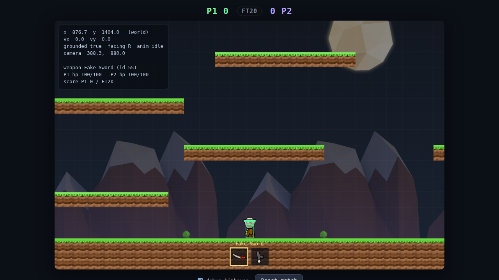

# PvP Arena — movement prototype + Diggerz reference

A standalone browser prototype that recreates the **Diggerz-style movement
feel** as clean, reusable code, plus a set of modules that faithfully recreate
the **confirmed** Diggerz client systems (input, character rig, items) to build
the real PvP game on top of.

Single player. No networking. **Combat V1** is implemented using the confirmed
Diggerz weapons (Fake Sword + Blue Ray Gun) with the real Diggerz controls.
Combat *resolution* values (damage/range/cooldown/projectile/respawn) are
**proposed standalone PvP values**, not extracted (the original server combat
logic is lost — see the docs).



## Run it

```bash
cd arena
node serve.js          # http://localhost:8080
```
Open the URL.

Controls (the real Diggerz scheme — no J/K, no number keys):

- **Move:** `A`/`D` or `←`/`→`
- **Jump:** `W` / `↑` / `Space` — hold for height, tap for a small hop
- **Descend:** `S` / `↓`
- **Aim:** mouse
- **Use weapon:** left-click
- **Select weapon:** mouse wheel
- Reset match / toggle debug hitboxes: on-screen button + checkbox (not keybinds)

Run the headless logic tests:

```bash
npm test
```

## What's implemented

- A large PvP arena (**100×38 tiles = 4000×1520 world**) with a wide floor,
  boundary walls, an open centre, and spread-out reachable multi-height
  platforms (`src/game/arenaMap.js`); spawn points (P1 left, P2 right) in the map
- A **follow camera** (`src/game/Camera.js`): fixed 1000×640 viewport, smooth
  (non-floaty) follow, clamped to the world bounds; HUD/hotbar/debug stay fixed
  to the screen; the debug overlay shows true world coords + camera x/y
- **Real Diggerz presentation:** a parallax backdrop from `bknd.png` (mountains,
  hills, moon — `src/render/Background.js`), the official `loading.jpg` loading
  screen, and `favicon.png` as the app icon
- One controllable player
- Gravity + capped fall speed
- Accelerated horizontal movement with ground/air friction
- Jumping with **coyote time**, **jump buffering**, and **variable height**
- AABB collision against tile/platform blocks (with flush ground-snap)
- Velocity tracking, facing direction, animation-state values
- FT20 score placeholder in the HUD (no scoring logic yet)
- Debug overlay: `x, y, vx, vy, grounded, facing, anim`
- Diggerz-style rendering: real Diggerz tiles + character sprites
- **Combat V1:** a dummy opponent with health + hurtbox; a hotbar (mouse-wheel
  select) rendering the real **Fake Sword** + **Blue Ray Gun** sprites;
  left-click uses the selected weapon; sword = melee arc, ray gun = projectile;
  health / death / respawn / brief spawn-invulnerability; **FT20 kill scoring**
  with a win banner; health bars, selected-weapon label, score, and debug
  hitboxes. All combat numbers are PROPOSED values in `src/combat/CombatConfig.js`.

## Documentation

- **`docs/DIGGERZ_CLIENT_MECHANICS_AUDIT.md`** — the real Diggerz client
  mechanics (input, rendering, items, networking, assets), each finding tagged
  Confirmed / Likely / Unknown / Placeholder. The source of truth.
- **`docs/DIGGERZ_WEAPON_CATALOG.md`** — the confirmed Diggerz weapon roster
  (38 real items: ids, names, sprites, atlas rects). Machine-readable form in
  `src/diggerz/DiggerzWeaponCatalog.js`.
- **`docs/STANDALONE_PVP_COMBAT_DESIGN.md`** — the proposed combat design for
  the standalone game.
- **`docs/DIGGERZ_UI_CATALOG.md`** — the real asset inventory (tiles/ui/bknd/
  loading/favicon) and the `ui.png` UI sprites identified for HUD/hotbar/
  buttons/arrows/health/score (ready to wire).

## Modules

```
src/
  main.js                  boot the scene
  game/
    MovementController.js   the "feel": gravity, accel, jump, anim — PURE logic
    TileCollision.js        AABB-vs-tile resolution + ground snap — PURE logic
    PlayerController.js      binds input + body + movement
    InputState.js            keyboard -> movement intents
    ArenaScene.js            viewport, game loop, camera, HUD, debug, rendering
    arenaMap.js              the 80x34 arena (floor/walls/platforms) + spawns
    Camera.js                follow camera with smoothing + world clamping
  render/
    AssetStore.js            loads the real Diggerz atlas (tiles.png) if present
    TileSprites.js           real dirt/grass/stone tiles, else procedural texture
    CharacterSprite.js       real torso+head sprite, else procedural character
    SpriteAnimation.js       reusable sprite-sheet frame stepper
    Background.js            real bknd.png parallax backdrop (mountains/hills/moon)
  diggerz/                  ← faithful recreations of CONFIRMED client systems
    InputBindings.js         real key/mouse/wheel bindings (audit §1)
    CharacterRig.js          real parts, animation states, facing, aim encoding
    ItemSystem.js            real hotbar/slot model (type, count, wheel select)
    WeaponSystem.js          confirmed "use intent" (opcode 287) + animation only
    CombatController.js      wires the confirmed flow; resolution is delegated
    DiggerzWeaponCatalog.js  38 confirmed weapons (id, name, sprite, rect)
  combat/                   ← Combat V1 (confirmed weapons; PROPOSED resolution)
    CombatConfig.js          all combat numbers (PROPOSED standalone), tunable
    geometry.js  Health.js  MeleeResolver.js  ProjectileResolver.js
    MatchState.js            FT20 kill scoring
    CombatSystem.js          headless orchestrator (local now, server later)
    CombatInput.js           mouse aim / left-click use / wheel select (DOM)
assets/
  tiles.atlas.json         recovered sprite rects (698 sprites) — see "Assets"
serve.js                   zero-dependency static server (ES modules need http)
tests/movement.test.js     headless physics checks (no DOM)
tests/diggerz.test.js      headless checks of the confirmed Diggerz systems
```

The `src/diggerz/` modules contain **only confirmed** client behavior — no
invented damage, ranges, cooldowns, or projectiles. Those were server-side and
are deliberately left out until the combat design is approved.

## Assets — real Diggerz sprites

The **real Diggerz assets are now in `assets/`** — the original
`tiles.png` (2048×2048 atlas), `ui.png`, `bknd.png`, `favicon.png`, alongside
the recovered `tiles.atlas.json` (698 sprite rects). The arena renders the real
sprites (console: *"real Diggerz tiles.png loaded"*); the procedural art is now
only a fallback if `tiles.png` is missing.

| Sprite | Name | Rect (x, y, w, h) |
| --- | --- | --- |
| Dirt block | `B108_0_PNG` | 1091, 62, 64, 64 |
| Grass surface block | `B100_0_PNG` | 149, 62, 64, 64 |
| Stone block | `B216_0_PNG` | 430, 286, 64, 64 |
| Character torso | `ADVTORSO_PNG` | 138, 4, 34, 39 |
| Character head | `ALIENHEAD_PNG` | 18, 61, 60, 65 |
| Fake Sword (weapon) | `SWORD_PNG` | 1442, 720, 70, 38 |

The 38 confirmed weapons (verified against the real `tiles.png`) are in
`docs/DIGGERZ_WEAPON_CATALOG.md` / `src/diggerz/DiggerzWeaponCatalog.js`.

## Tuning the feel

All movement constants live in `MovementController.DEFAULTS` (gravity, move
speed, accel/friction, jump speed, coyote/buffer times, jump-cut).

## Verified

- `npm test` — 6 movement + 7 arena + 7 Diggerz-mechanics + 9 combat headless
  checks (movement physics; arena size/spawns/landing/traversal/boundary-walls/
  jump-reachability/camera-clamp; real bindings/aim/animation; sword + ray gun
  hits, death, respawn + invulnerability, score, FT20 win, reset).
- Browser smoke (Chromium) — real assets load; the camera follows the player
  across the large arena and clamps to bounds; combat input still works.

## Not in scope yet (intentionally)

More weapons (Shotgun is next, using the real client's shotgun functions),
multiplayer, ranked, tournaments, cosmetics, accounts, rollback. Combat V1 is
local single-player vs a dummy.
