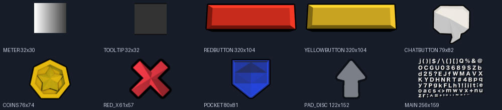

# UI asset audit — `ui.png` (confirmed from client + assets)

Audit of the real Diggerz UI atlas for the PvP prototype. Sprite rectangles are
recovered from the client (`diggerz_v-203.js`) into `assets/ui.atlas.json` and
**verified against the real `ui.png` pixels** (`ui_asset_audit.png`). Nothing
invented.

`ui.png` is 2048×2048 with **251 sprites**, but **236 are country flags**; only
**15 are actual UI elements** (listed below).

## Usable UI sprites, mapped to each need

| UI need | Sprite key | Rect `[x,y,w,h]` | Notes |
| --- | --- | --- | --- |
| **Health bar** | `METER_PNG` | 193, 16, 32, 30 | light gradient meter — scale horizontally for HP |
| **Hotbar slot** | `POCKET_PNG` | 990, 147, 80, 81 | blue slot "pocket"; or `TOOLTIP_PNG` (32²) panel |
| **Panel / tooltip bg** | `TOOLTIP_PNG` | 594, 16, 32, 32 | rounded dark panel (9-slice-able) |
| **Primary button** | `REDBUTTON_PNG` | 1071, 147, 320, 104 | e.g. reset / confirm |
| **Secondary button** | `YELLOWBUTTON_PNG` | 1645, 147, 320, 104 | e.g. menu / rematch |
| **Chat button** | `CHATBUTTON_PNG` | 73, 147, 79, 82 | speech-bubble icon |
| **Score / currency** | `COINS_PNG` | 154, 66, 76, 74 | gold star/coin icon next to the score |
| **Close (X)** | `RED_X_PNG` | 0, 145, 61, 57 | dialog/close button |
| **Arrow** | `PAD_DISC_PNG` | 747, 147, 122, 152 | up-arrow (the touch d-pad disc); rotate for L/R/Down |
| **Touch d-pad base** | `PAD_BASE_PNG` | 410, 147, 336, 122 | mobile only — not needed for desktop |
| **Text (HUD / match status)** | `MAIN_PNG` / `MAIN_BIG_PNG` | 153,147,256,159 / 153,307,512,256 | the Diggerz bitmap font sheets |
| **Vignette / shading** | `SHADING_PNG` | 1515, 148, 128, 128 | screen shading overlay |
| **Border piece** | `RECT_SIDES_PNG` | 68, 58, 8, 4 | UI frame edge |
| **Cart item** | `BASIC_CART_PNG` | 0, 16, 66, 49 | gameplay (not HUD) |

## Recommended mapping for the PvP HUD (when we wire UI)

- **HUD score / match status** → `COINS_PNG` icon + `MAIN_BIG_PNG` bitmap font
  for the `P1 n — FT20 — n P2` line and the win banner.
- **Hotbar** → `POCKET_PNG` (or `TOOLTIP_PNG`) slot background + the real weapon
  sprite from `tiles.png`, with `PAD_DISC_PNG` arrows as a selection hint.
- **Health bars** → `METER_PNG` (scaled to HP fraction), optionally framed with
  `RECT_SIDES_PNG`.
- **Buttons** (reset / menu) → `REDBUTTON_PNG` / `YELLOWBUTTON_PNG`;
  **close** → `RED_X_PNG`.

> Status: **identified + verified, not yet wired** (this turn is map scale +
> presentation only; no combat/UI behaviour changes). The hooks
> (`ui.atlas.json` + an AssetStore-style loader) make wiring these a contained
> follow-up.

## Other real assets in the prototype

| File | Use | State |
| --- | --- | --- |
| `tiles.png` | terrain + character + weapon sprites | wired |
| `bknd.png` | parallax backdrop (mountains/hills/moon) | wired (`Background.js`) |
| `loading.jpg` | loading screen | wired |
| `favicon.png` | app favicon | wired |
| `ui.png` | HUD/hotbar/buttons (above) | audited, ready to wire |

## Explicitly excluded (security + scope)

Per request, these are **not** imported into the prototype, and the **sitemap is
never committed** (it may contain sensitive `changeuserinfo` URLs):
`sitemap.xml`, `tag.min.js`, `OneSignalSDK.js`, `cmp.min.css`, `mappings.json`,
and any ad/analytics scripts. `FileSaver` / `howler` / `pako` are also unused.
